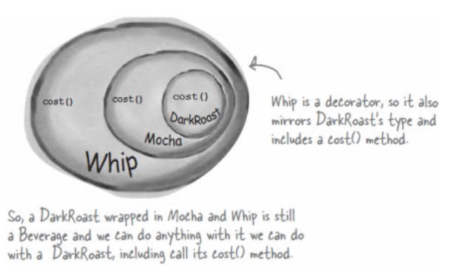
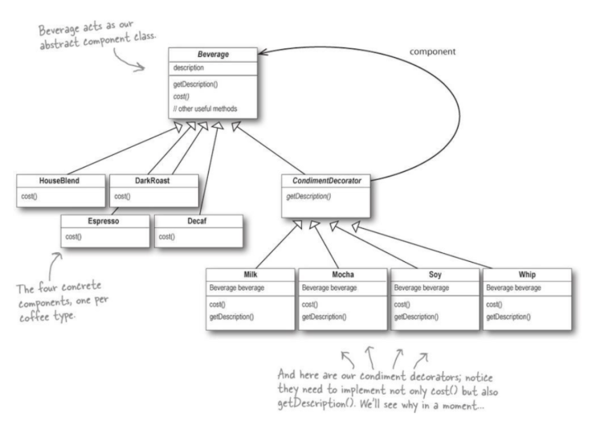
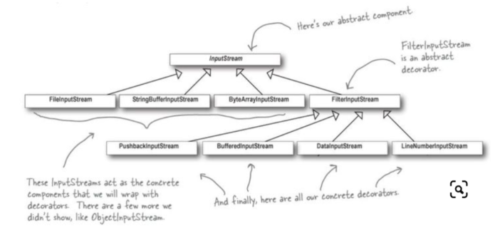

# 데코레이터 패턴

## 개념
데코레이터패턴은 객체에 추가 요소를 동적으로 더할 수 있다.

예를 들어, 커피를 시킬 때 Mocha를 추가하거나, Shot을 추가하는 등 여러 행동을 위에 추가할 수 있다.



## 구현방법
핵심은 실제 커피와, 데코레이터들이 같은 함수를 구현해야한다.

이를 위해, 같은 Beverage라는 클래스를 상속받아서 각각의 내용을 구현해야한다. 

그 이유는, 데코레이터를 끊임없이 쌓을 수 있게 하기 위해서이다.

우리의 목적은 아래와 같이 Decorator가 커피를 계속해서 감싸는 것이다.

```java
public static void main(String[] args) {
    Beverage beverage = new Espresso();
    beverage = new Mocha(beverage); // 모카 추가
    beverage = new Milk(beverage); // 우유 추가
    beverage = new Milk(beverage); // 우유 한번 더 추가
    System.out.println("가격 " + beverage.cost());   
}
```

이를 위해 아래와 같이 클래스를 선언하면 Decorator 안에 계속해서 Beverage인 음료들을 담으면서 가격을 더하거나 description을 추가할 수 있다.





핵심은 Milk(beverage)를 받았을 때, Milk의 this.beverage = beverage로 해줌으로써 받은 음료를 꾸미고 

꾸민 음료를 계속해서 다음 데코레이터에 넘겨줄 수 있도록 한다.

## 특징
장단점
- 유연성 : 코드 수정 없이 동적으로 계속해서 행동을 추가할 수 있다.
- 러닝커브 : 구조도를 알아야 한다 → 잡다한 클래스들을 모두 알아야 한다.

## 예시



자바의 I/O 클래스들도 데코레이터패턴을 통해 구현되어 있다.

그렇기 때문에 <b> PushbackInputStream(BufferedInputStream(FileInputStream))); </b> 와 같은 사용이 가능한 것이다.