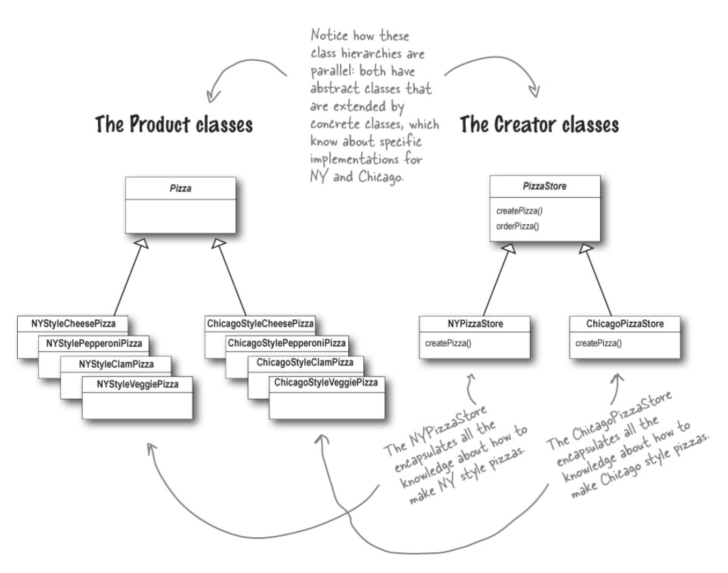
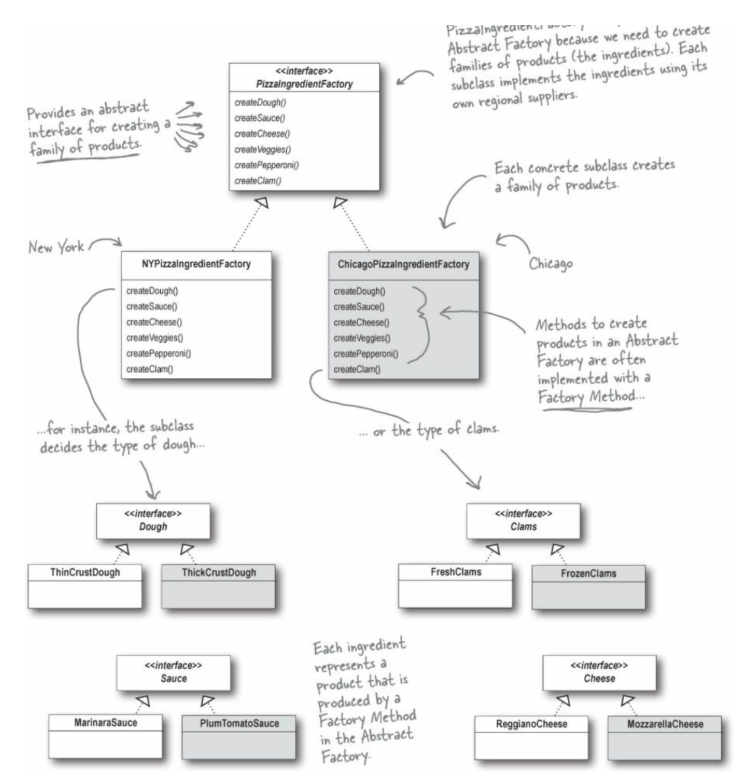

# 팩토리 메서드 패턴

## 개념
팩토리 패턴은 객체 생성을 처리하는 디자인 패턴이다. 

이 패턴은 객체 생성 코드를 전체 애플리케이션에서 분리하여, 클라이언트 코드가 구체적인 클래스에 의존하지 않고 객체를 생성할 수 있게 한다. 

팩토리 패턴은 주로 

1. 팩토리 메소드 패턴

2. 추상팩토리 패턴 

두 가지 형태로 나타납니다.

## 구현방법
팩토리 메소드 패턴에서는 생성할 객체의 클래스를 선택하는 책임을 하위 클래스에 위임한다. 

이를 통해, 피자가게에서 피자를 굽고, 자르고, 포장하는 일을 할 때, 어떤 피자의 종류인지 알 필요 없게 된다. 

단지 하위 클래스에서 자기가 원하는 피자를 생산해서, 굽고 자르고 포장하는 일을 이어받아 하면 된다. 

상위 클래스는 어떤 종류의 피자인지 상관 하지 않고

그냥 pizza라는 인터페이스를 구현한 인스턴스를 인스턴스를 굽고, 자르고, 포장하는 공통 적인 부분만 구현하면 된다.

피자가게 예시로 보면 이 패턴은 다음과 같은 구성 요소를 갖는다.

```
Pizza: 생성될 객체의 인터페이스.
ConcretePizza: Pizza 인터페이스를 구현하는 클래스.
PizzaStore: Pizza 객체를 반환하는 “추상”메소드가 선언되어 있는 클래스.
ConcretePizzaStore: PizzaStore 클래스를 상속받아 Pizza 객체를 생성하는 메소드를 구현하는 클래스.
```

이 관계를 클래스 다이어그램으로 보면 아래와 같다.



ConcretePizzaStore의 createPizza()는 Pizza를 구현한 ConcretePizza를 반환시키게 하고, 

orderPizza()에서는 이 반환된 ConcretePizza 를 처리한다.

추상 팩토리 패턴은 관련 있는 여러 종류의 객체를 일관된 방식으로 생성할 수 있는 인터페이스를 제공한다. 

팩토리 메소드 패턴을 한 단계 더 추상화 한 것이라고 보면 된다. 

종종 다수의 팩토리 메소드 패턴을 활용해 구현된다. 

이 패턴은 다음과 같은 구성 요소를 갖는다.

```
AbstractFactory: 생성할 제품 그룹의 메소드를 선언하는 인터페이스.
ConcreteFactory: 구체적인 제품을 생성하는 메소드를 구현하는 클래스.
AbstractProduct: 생성될 객체 그룹의 인터페이스.
ConcreteProduct: 구체적인 제품을 나타내는 클래스.
```

이를 다이어그램으로 보면 아래와 같다. 

재료를 생성할 때, 각각의 재료가 특정 조건을 만족하도록 하여 (일관된 방식으로) 재료들을 가져올 수 있다.



## 특징
- 타입 안전성과 일관성 
  - 팩토리 패턴은 생성할 객체의 타입을 보장하며, 생성 과정에서 일관성을 유지할 수 있다.
- 유연성
  - 새로운 객체 타입을 추가할 때 기존 코드를 변경하지 않고 확장할 수 있다. <br> 이는 오픈/클로즈 원칙을 따르며, 시스템의 유연성을 향상시킨다.
- 결합도 감소
  - 클라이언트 코드와 객체 생성 코드 사이의 결합도를 감소시키기 때문에, 코드의 유지보수가 용이해진다.