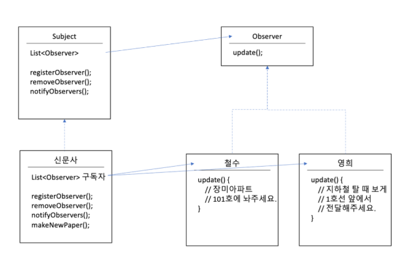

# 옵저버 패턴

## 개념
옵저버패턴은 한 객체의 상태가 바뀌면 그 객체에 의존하는 다른 객체에게 연락이 가고 

자동으로 내용이 갱신되는 방식으로 일대다 의존성을 정의한다.

쉽게말해, 신문사가 신문을 뿌리면, 구독자는 신문을 받아볼 수 있다.

## 구현방법
신문사는 Subject 인터페이스를, 구독자 Observer 인터페이스를 구현하고, 신문사에 구독자를 등록하면 된다. 

일반적으로 Subject 인터페이스는 Observer들을 관리하는 아래의 함수를 갖고 있다.

1.<t> registerObserver()

2.<t> removeObserver() 

3.<t> notifyObservers() 

일반적으로 Observer 내가 어떻게 정보를 받을 수 있는지 방법을 알려주는 update() 함수를 갖고있다.



위와 같이, 신문사는 Subject를 구현해서 기본 함수를 이용해 Observer를 구현한 철수와 영희를 등록할 수 있다. <br>
그 다음, notifyObservers에서 아래와 같이 각각의 객체의 update를 해주면, 각각의 객체가 원하는 방식으로 신문을 받아볼 수 있다.

```java
notifyObservers() {
    for (Observers obsever: 구독자) {
        observer.update(신문);
    }
}
```

## 특징
느슨한 결합을 사용해 사용자마다 유연한 방법으로 전달해줄 수 있다.

## 예시

(스윙라이브러리) GUI에서 버튼에 event를 감시하는 방법도 옵저버로 진행된다. mouseClick이 일어나면, 

mouseClick에 등록된 eventListener들이 그 소식을 받게 되고, 이벤트가 진행되게된다.

<b> Push방식 vs Pull 방식 </b>

위에서 설명한 방식은 신문사가 구독자에게 push하는 방식이다.

이를 구독자가 원할 때 마다 pull을 하는 방식으로 바꿀 수 있다. 

이 때는, 신문사에 getNewsPaper()를 추가하고, 구독자가 필요시 신문사.getNewPaper()를 하면 된다.