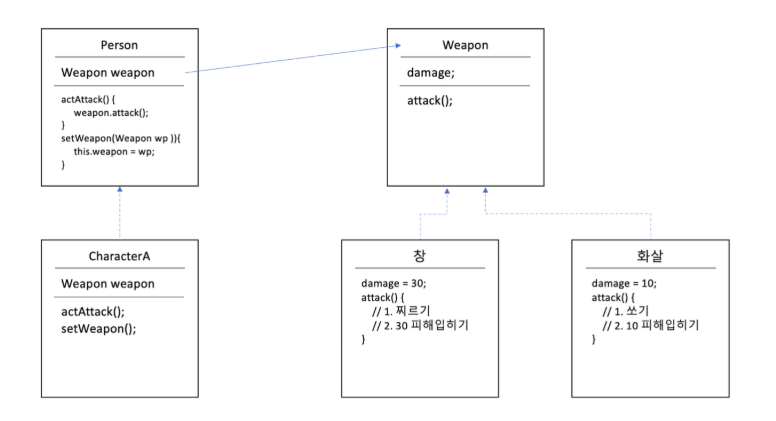

# 전략패턴

## 개념
전략패턴은 알고리즘군을 정의하고 캡슐화해서 각각의 알고리즘군을 수정해서 사용할 수 있게 한다. 
쉽게 말해, 게임 캐릭터가 “공격” 이라는 행동을 했을 때, [대검, 화살, 창] 등 어떤 무기를 들고 있던지 그 무기에 맞춰 공격할 수 있다.   
또한, 언제든 동적으로 무기를 수정할 수 있도록 해준다.

## 구현방법
각각의 무기 item들은 “무기”라는 인터페이스를 구현하고, 공격방식을 각각 구현해주면 해주면 된다.   
사용자는 “무기” 라는 추상클래스를 만들고 그 무기의 동작을 수행하도록 하면 된다.

## 특징
아래 그림에서 characterA는 어떤 무기를 갖고 있는지 알 필요 없이, actAttack()을 하면 해당 무기를 공격 할 수 있다.   
setWeapon을 통해 게임 중 무기를 동적으로 바꿀수도 있다.   
또한, 어떤 새로운 무기가 추가 되더라도 Weapon을 상속받아 구현하기만 하면 characterA는 그 무기를 사용할 수 있다.